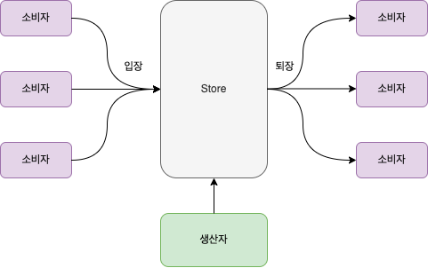

생산자 - 소비자 솔루션
Thread 를 이용해 생산자와 소비자가 거래하는 생산자 - 소비자 솔루션을 구성해본다.

Exam- 01. 마트 내에 위치한 매장(Store) 을 정의하라.
- 매장은 물건을 납품 받아서 판매한다.
- 매장에는 최대 10개의 물건만 전시할 수 있다.
- 매장은 최대 5명까지만 동시 입장 가능하다.
- 매장에서 물건 구매는 동시에 1명만 가능하다.
- 매장에서 물건 판매 후 빈 공간이 생기면 생산자에게 알려준다.
- 매장에서 물건 납품은 동시에 1명만 가능하다.
- 매장에서 물건이 들어오면 소비자에게 알려준다.

    public class Store {
    ...
    
        public Store() {
                    ...
        }
    
        public void enter() {
                    ...
    
        }
    
        public void exit() {
                    ...
        }
    
        public synchronized void buy() {
                    ...
        }
    
        public synchronized void sell() {
                    ...
        }
    }

Exam-02. 매장에 물건을 납품하는 생산자(Producer)을 정의하라.
- 생산자는 매장에 물건이 부족하지 않도록 채워둔다.
- 물건은 1~10초 간격으로 채운다.
- Thread내에서 난수 생성을 위해서는 ThreadLocalRandom.current().nextInt()를 사용하면 된다.

    import java.util.concurrent.ThreadLocalRandom;
    
    public class Producer implements Runnable {
    ...
    
        public Producer(Store store) {
            ...
        }
    
        @Override
        public void run() {
                    ...
        }
    }

Exam-03. 매장에 물건을 구매하는 소비자(Consumer)을 정의하라.
소비자는 매장에 입장 후 물건을 구매할 수 있다.

매장에는 입장 인원 제한이 있으므로, 인원 초과시 기다린다.

매장에 입장하면 물건을 구매하고, 퇴장한다.

1~10초 간격으로 구매한다.

    import java.util.concurrent.ThreadLocalRandom;
    
    public class Consumer implements Runnable {
    Store store;
    ...
    
        public Consumer(String name, Store store) {
            ...
        }
    
        @Override
        public void run() {
                    ...
        }
    }